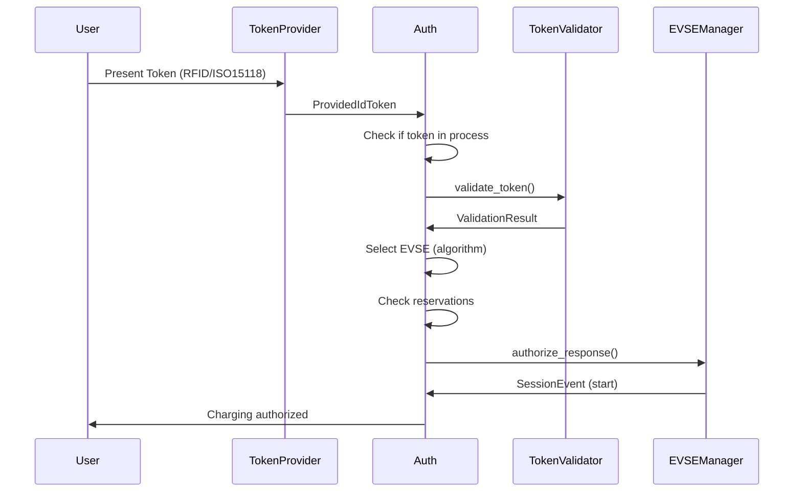
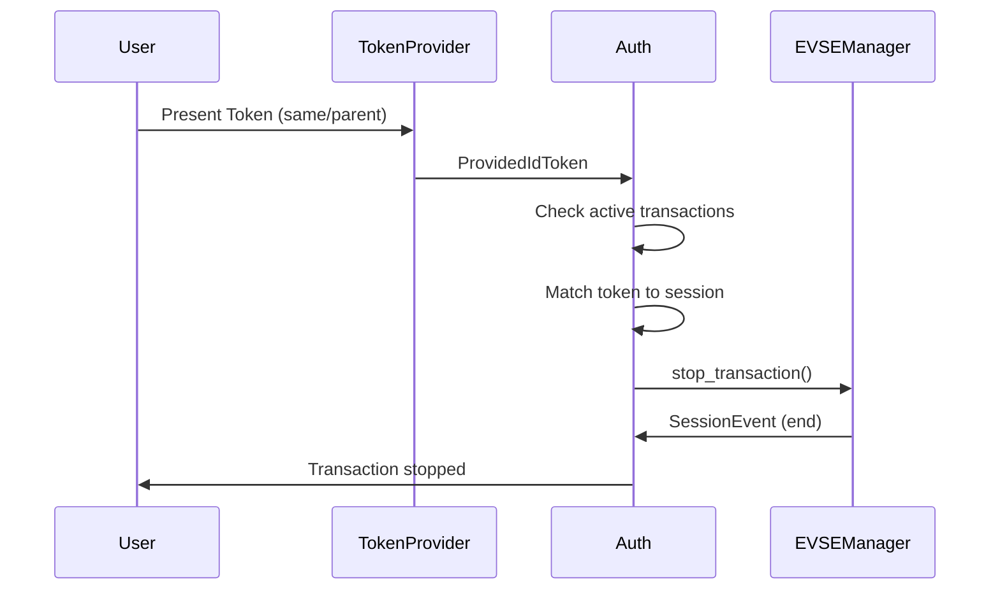

# EVerest Auth Module Documentation

## Table of Contents
1. [Overview](#overview)
2. [Architecture](#architecture)
3. [Core Functionality](#core-functionality)
4. [Security Features](#security-features)
5. [Configuration](#configuration)
6. [Interfaces](#interfaces)
7. [Authorization Flow](#authorization-flow)
8. [Reservation Management](#reservation-management)
9. [Cybersecurity Analysis](#cybersecurity-analysis)
10. [Fraud Prevention Mechanisms](#fraud-prevention-mechanisms)
11. [Potential Vulnerabilities](#potential-vulnerabilities)
12. [Security Best Practices](#security-best-practices)

## Overview

The Auth module is a critical component of the EVerest charging infrastructure that handles authentication, authorization, and reservation management for Electric Vehicle Supply Equipment (EVSE). It serves as the central authority for validating charging requests, managing connector access, and ensuring secure operations across multiple charging points.

### Key Responsibilities
- **Authentication & Authorization**: Validates ID tokens (RFID, ISO15118, etc.) for charging sessions
- **Reservation Management**: Handles advance booking of charging connectors
- **Session Control**: Manages the lifecycle of charging sessions including start/stop operations
- **Security Enforcement**: Implements multiple layers of security controls and access validation
- **Multi-Connector Support**: Coordinates access across multiple EVSE connectors with intelligent selection algorithms

## Architecture

### Component Structure
```
Auth Module
├── Auth.cpp/.hpp           # Main module interface
├── AuthHandler             # Core authentication logic
├── ReservationHandler      # Reservation management
└── Connector              # Individual connector management
```

### Dependencies
- **Token Providers**: Sources of authentication tokens (RFID readers, ISO15118, mobile apps)
- **Token Validators**: External validation services (OCPP backends, local databases)
- **EVSE Managers**: Physical charging point controllers
- **Key-Value Store (KVS)**: Persistent storage for reservations and session data

## Core Functionality

### 1. Token Processing Pipeline

The Auth module processes incoming authentication tokens through a sophisticated multi-stage pipeline:

#### Token Reception and Validation
1. **Token Input**: Receives `ProvidedIdToken` from various sources
2. **Duplicate Detection**: Prevents processing of tokens already in progress
3. **External Validation**: Delegates to configured token validators
4. **Authorization Decision**: Determines access based on validation results

#### Token Types Supported
- **RFID**: Traditional contactless cards/fobs
- **ISO15118**: Plug & Charge with PKI certificates
- **Central**: Backend-authorized tokens
- **Local**: Locally stored credentials
- **Remote**: Mobile app or web-based authentication

### 2. Connector Selection Algorithms

The module implements multiple strategies for selecting appropriate connectors:

#### PlugEvents Algorithm
- Prioritizes recently plugged-in vehicles
- Maintains a queue of plug-in events
- Assigns tokens to the most recent connection

#### FindFirst Algorithm  
- Selects the first available connector
- Simple round-robin approach
- Suitable for basic installations

#### Future: UserInput Algorithm
- Placeholder for manual selection
- Intended for display-based systems

### 3. Transaction Management

#### Session Lifecycle
1. **Authorization**: Token validation and connector assignment
2. **Session Start**: Notification to EVSE Manager to begin charging
3. **Active Monitoring**: Tracking session state and events  
4. **Session End**: Processing stop requests and cleanup
5. **Post-Session**: Reservation updates and status notifications

#### Stop Transaction Mechanisms
- **Token Re-presentation**: Same token used to stop active session
- **Parent Token**: Using hierarchical token relationships
- **Master Pass**: Emergency stop capability for authorized personnel
- **Remote Stop**: Backend-initiated termination
- **Fault Conditions**: Automatic stop on connector faults

## Security Features

### 1. Authentication Security

#### Token Validation Framework
- **Multi-Validator Support**: Up to 128 concurrent validators
- **Validation Result Aggregation**: Combines multiple validation outcomes
- **Timeout Protection**: Prevents indefinite validation delays
- **Failure Handling**: Graceful degradation on validator failures

#### Authorization Status Types
- `Accepted`: Token validated and authorized
- `Rejected`: Token invalid or unauthorized  
- `Unknown`: Validation inconclusive
- `NotAtThisLocation`: Valid token, wrong location
- `NotAtThisTime`: Valid token, timing restrictions

### 2. Access Control

#### Master Pass System
- **Emergency Override**: Special tokens that can stop any transaction
- **Group-Based Control**: Configurable master pass group ID
- **Law Enforcement Support**: Designed for emergency vehicle removal
- **Audit Trail**: All master pass usage logged

#### Reservation-Based Access Control
- **Pre-Authorization**: Advanced booking with token binding
- **Time-Limited Access**: Automatic expiration of reservations
- **Exclusive Access**: Reserved connectors unavailable to others
- **Priority Handling**: Reserved users get guaranteed access

### 3. Session Security

#### Identifier Management
- **Unique Session IDs**: Each session gets unique identifier
- **Token Binding**: Sessions bound to specific tokens
- **Parent-Child Relationships**: Hierarchical token support
- **Anti-Replay Protection**: Prevents token reuse attacks

## Configuration

### Critical Security Parameters

```yaml
selection_algorithm: "FindFirst"  # Connector selection strategy
connection_timeout: 60           # Authorization validity period (seconds)
master_pass_group_id: ""        # Emergency override group ID
prioritize_authorization_over_stopping_transaction: true
ignore_connector_faults: false  # Security vs availability trade-off
```

### Security Implications of Configuration

#### Connection Timeout
- **Too Short**: Legitimate users may be denied access
- **Too Long**: Increases window for unauthorized access
- **Recommended**: 30-300 seconds based on user experience requirements

#### Master Pass Group ID
- **Empty**: No emergency override capability
- **Configured**: Enables law enforcement/emergency access
- **Security Risk**: Must be kept confidential and audited

#### Ignore Connector Faults
- **False (Secure)**: Prevents access to faulty equipment
- **True (Availability)**: Allows charging despite minor faults
- **Risk**: May enable charging on unsafe connectors

## Interfaces

### Provided Interfaces

#### Auth Interface (`auth`)
- `set_connection_timeout(seconds)`: Dynamic timeout adjustment
- `set_master_pass_group_id(group_id)`: Master pass configuration
- `withdraw_authorization(request)`: Revoke granted access

#### Reservation Interface (`reservation`)
- Handles advance booking requests
- Publishes reservation status updates
- Manages reservation cancellations

### Required Interfaces

#### Token Provider (`auth_token_provider`)
- Receives tokens from RFID readers, mobile apps, etc.
- Supports 1-128 concurrent providers
- Provides `ProvidedIdToken` events

#### Token Validator (`auth_token_validator`)
- External validation services (OCPP, local DB)
- Supports 1-128 concurrent validators  
- Returns `ValidationResult` with authorization status

#### EVSE Manager (`evse_manager`)
- Controls physical charging equipment
- Provides session events and state updates
- Supports 1-128 connectors

## Authorization Flow

### Normal Authorization Sequence



### Stop Transaction Flow



## Reservation Management

### Reservation Types

#### EVSE-Specific Reservations
- **Targeted**: Bound to specific connector
- **Guaranteed Access**: Connector held exclusively
- **Higher Priority**: Takes precedence over global reservations

#### Global Reservations  
- **Flexible**: Any available connector
- **Load Balancing**: Distributed across connectors
- **Lower Priority**: May be bumped by specific reservations

### Reservation Lifecycle

1. **Creation**: Request with ID token and time parameters
2. **Validation**: Check connector availability and conflicts
3. **Activation**: Connector marked as reserved
4. **Usage**: Token presented and reservation consumed
5. **Expiration**: Automatic cleanup of unused reservations
6. **Cancellation**: Manual or automatic removal

### Reservation Security

#### Access Validation
- Token must match reservation exactly
- Parent token relationships supported
- Time-based validation (not before/after)
- Location-specific enforcement

#### Fraud Prevention
- Reservation ID uniqueness enforced
- Expiration prevents indefinite holds
- Audit logging of all reservation activities
- Conflict detection and resolution

## Cybersecurity Analysis

### Attack Surface Assessment

#### 1. Token-Based Attacks

**RFID Token Cloning/Skimming**
- **Risk Level**: HIGH
- **Attack Vector**: Physical interception of RFID communications
- **Mitigations**: 
  - Encrypted RFID protocols (DESFire, MIFARE Plus)
  - Token validation with backend systems
  - Usage pattern anomaly detection
- **Current Protection**: External validator verification

**ISO15118 Certificate Attacks**
- **Risk Level**: MEDIUM  
- **Attack Vector**: Compromised or fraudulent certificates
- **Mitigations**:
  - PKI certificate validation
  - Certificate revocation checking
  - Root CA trust validation
- **Current Protection**: Delegated to ISO15118 stack and validators

**Token Replay Attacks**
- **Risk Level**: MEDIUM
- **Attack Vector**: Reusing captured token data
- **Mitigations**:
  - Session binding prevents reuse
  - Time-based validation windows
  - Nonce or challenge-response protocols
- **Current Protection**: Session state tracking, timeout enforcement

#### 2. Authorization Bypass

**Master Pass Abuse**
- **Risk Level**: HIGH
- **Attack Vector**: Unauthorized access to master pass tokens
- **Mitigations**:
  - Strict master pass key management
  - Audit logging of all master pass usage
  - Time-limited master pass validity
- **Current Protection**: Configurable group ID, logging

**Reservation Manipulation**
- **Risk Level**: MEDIUM
- **Attack Vector**: Creating fraudulent or overlapping reservations
- **Mitigations**:
  - Strong reservation ID generation
  - Conflict detection algorithms
  - Time-bound reservation validity
- **Current Protection**: UUID-based IDs, expiration timers

**Session Hijacking**
- **Risk Level**: MEDIUM  
- **Attack Vector**: Taking over active charging sessions
- **Mitigations**:
  - Strong session identifiers
  - Token binding to sessions
  - Session state validation
- **Current Protection**: Token-session binding, state machine

#### 3. Denial of Service

**Token Flooding**
- **Risk Level**: MEDIUM
- **Attack Vector**: Overwhelming system with fake tokens
- **Mitigations**:
  - Rate limiting on token processing
  - Input validation and sanitization
  - Resource usage monitoring
- **Current Protection**: Processing queue management

**Reservation Exhaustion**
- **Risk Level**: MEDIUM
- **Attack Vector**: Creating excessive reservations to block access
- **Mitigations**:
  - Reservation limits per user/token
  - Shorter reservation validity periods
  - Reservation usage monitoring
- **Current Protection**: Expiration timers, conflict detection

**Connector Blocking**
- **Risk Level**: LOW
- **Attack Vector**: Preventing legitimate users from accessing connectors
- **Mitigations**:
  - Timeout enforcement for idle connections
  - Administrative override capabilities
  - Usage monitoring and alerting
- **Current Protection**: Connection timeouts, master pass override

### Fraud Use Cases Analysis

#### 1. Free Charging Attacks

**Scenario**: Attacker attempts to charge without payment authorization

**Attack Methods**:
- Cloned payment cards or RFID tokens
- Exploiting authorization bypass vulnerabilities
- Man-in-the-middle attacks on validation communications
- Physical tampering with token readers

**Current Protections**:
- Multi-layer validation through external validators
- Backend authorization requirements
- Session binding to prevent token sharing
- Audit logging for forensic analysis

**Recommendations**:
- Implement cryptographic token validation
- Add biometric or PIN-based secondary authentication
- Monitor for unusual usage patterns
- Implement real-time fraud detection algorithms

#### 2. Service Disruption Attacks

**Scenario**: Attacker prevents legitimate users from accessing charging services

**Attack Methods**:
- Mass reservation of all connectors
- Token flooding to overwhelm processing
- Physical blocking of connectors
- Jamming of communication channels

**Current Protections**:
- Reservation expiration timers
- Processing queue management
- Master pass emergency override
- Fault detection and reporting

**Recommendations**:
- Implement user-based reservation limits
- Add geofencing for reservation validation  
- Enhance monitoring and alerting systems
- Deploy redundant communication channels

#### 3. Data Theft/Privacy Attacks

**Scenario**: Attacker seeks to collect user data or usage patterns

**Attack Methods**:
- Interception of token communications
- Exploitation of logging systems
- Social engineering of operators
- Physical access to systems

**Current Protections**:
- Token redaction in logs
- Limited data exposure in interfaces
- Encrypted communications (implementation dependent)

**Recommendations**:
- End-to-end encryption of all token communications
- Data minimization in logging and storage
- Regular security audits and penetration testing
- Implement privacy-preserving authentication methods

#### 4. Infrastructure Manipulation

**Scenario**: Attacker gains unauthorized control over charging infrastructure

**Attack Methods**:
- Exploitation of management interfaces
- Network-based attacks on control systems
- Physical tampering with equipment
- Supply chain attacks on firmware/software

**Current Protections**:
- Interface access controls
- Validation through external systems
- Session state management
- Error handling and fault detection

**Recommendations**:
- Implement strong authentication for management interfaces
- Deploy network segmentation and monitoring
- Add tamper detection to physical systems
- Establish secure software update mechanisms

## Potential Vulnerabilities

### 1. Configuration-Based Vulnerabilities

#### Weak Connection Timeouts
- **Issue**: Overly long timeouts create authorization windows
- **Impact**: Unauthorized users may gain access during valid authorization periods
- **Mitigation**: Set appropriate timeouts (30-300 seconds) based on operational needs

#### Master Pass Exposure
- **Issue**: Master pass group ID stored in plaintext configuration
- **Impact**: If exposed, allows anyone to stop any transaction
- **Mitigation**: Encrypt configuration, implement access controls, regular rotation

#### Disabled Fault Checking
- **Issue**: `ignore_connector_faults` may allow unsafe operations
- **Impact**: Users could access faulty/dangerous equipment
- **Mitigation**: Only enable in controlled environments with additional safety measures

### 2. Race Condition Vulnerabilities

#### Concurrent Token Processing
- **Issue**: Multiple identical tokens processed simultaneously
- **Impact**: Potential double authorization or resource conflicts  
- **Mitigation**: Enhanced mutex protection and token deduplication

#### Reservation Conflicts
- **Issue**: Simultaneous reservations for same connector
- **Impact**: Overlapping reservations leading to access disputes
- **Mitigation**: Atomic reservation operations and conflict detection

### 3. Input Validation Vulnerabilities

#### Token Data Validation
- **Issue**: Insufficient validation of token data structures
- **Impact**: Potential buffer overflows or injection attacks
- **Mitigation**: Strict input validation and sanitization

#### Reservation Parameter Validation  
- **Issue**: Missing validation of reservation timestamps and parameters
- **Impact**: Invalid reservations causing system instability
- **Mitigation**: Comprehensive parameter validation and bounds checking

### 4. State Management Vulnerabilities

#### Session State Corruption
- **Issue**: Inconsistent session state during error conditions
- **Impact**: Sessions may become stuck or improperly accessible
- **Mitigation**: Enhanced error handling and state recovery mechanisms

#### EVSE State Synchronization
- **Issue**: Auth module state may desynchronize with EVSE Manager
- **Impact**: Incorrect authorization decisions based on stale state
- **Mitigation**: Regular state synchronization and health checks

## Security Best Practices

### 1. Deployment Security

#### Network Segmentation
- Isolate Auth module on dedicated network segment
- Implement firewall rules restricting unnecessary access
- Use VPNs for remote management access
- Monitor network traffic for anomalies

#### Access Controls
- Implement role-based access control (RBAC)
- Use strong authentication for administrative access
- Regular access review and revocation procedures
- Principle of least privilege enforcement

### 2. Configuration Hardening

#### Secure Defaults
```yaml
# Recommended secure configuration
connection_timeout: 60              # Balanced security/usability
master_pass_group_id: ""           # Disable unless specifically needed
prioritize_authorization_over_stopping_transaction: true  # Security first
ignore_connector_faults: false     # Safety first
```

#### Parameter Validation
- Validate all configuration parameters on startup
- Implement configuration change auditing
- Use configuration management tools for consistency
- Regular security configuration reviews

### 3. Monitoring and Alerting

#### Security Event Monitoring
- Failed authentication attempts
- Master pass usage
- Unusual reservation patterns  
- Token validation failures
- System errors and exceptions

#### Audit Logging
- All authentication and authorization events
- Configuration changes
- Administrative actions
- System errors and security violations
- Ensure logs are tamper-evident and centrally stored

### 4. Incident Response

#### Security Incident Procedures
1. **Detection**: Automated monitoring and alerting
2. **Assessment**: Rapid impact evaluation
3. **Containment**: Immediate threat mitigation
4. **Eradication**: Root cause elimination
5. **Recovery**: Service restoration
6. **Lessons Learned**: Process improvement

#### Emergency Procedures
- Emergency shutdown capabilities
- Backup authentication mechanisms
- Manual override procedures for critical situations
- Communication plans for security incidents

### 5. Regular Security Maintenance

#### Vulnerability Management
- Regular security assessments and penetration testing
- Timely security patch application
- Vulnerability scanning and assessment
- Third-party security audits

#### Cryptographic Management
- Regular rotation of cryptographic keys
- Use of strong, industry-standard algorithms
- Secure key storage and distribution
- Certificate lifecycle management

## Conclusion

The EVerest Auth module provides a robust foundation for secure charging infrastructure authentication and authorization. However, like any security-critical system, it requires careful configuration, monitoring, and maintenance to remain secure against evolving threats.

Key security recommendations:
1. **Defense in Depth**: Implement multiple security layers
2. **Regular Updates**: Keep all components updated with security patches
3. **Monitoring**: Implement comprehensive security monitoring
4. **Training**: Ensure operators understand security implications
5. **Testing**: Regular security testing and vulnerability assessments

The module's design allows for flexibility while maintaining security, but operators must carefully balance security requirements with operational needs. Regular security reviews and updates to this documentation are recommended as the threat landscape evolves.